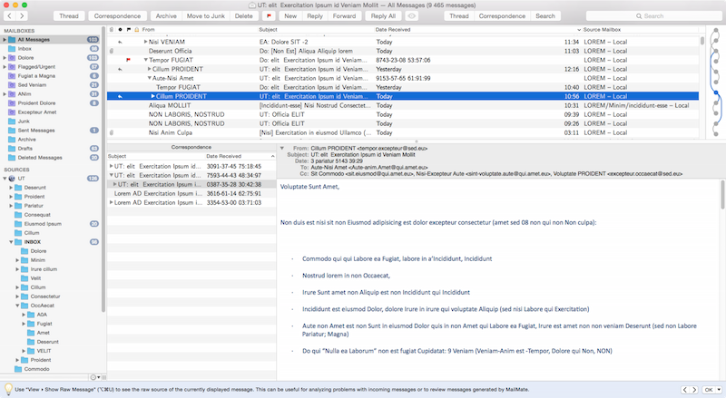
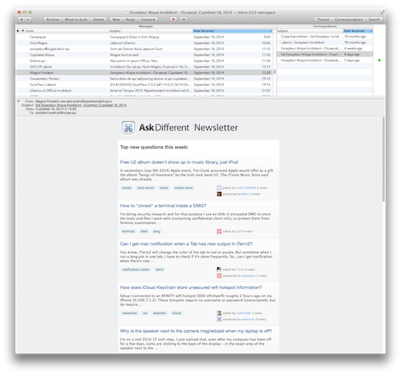
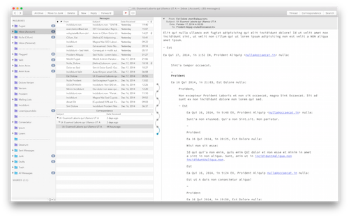

-*- mode: markdown; mode: visual-line; fill-column: 80 -*-

[](https://github.com/Falkor/MailMate)
[](http://www.gnu.org/licenses/gpl-3.0.html) [](http://gittip.com/Falkor) 

       Time-stamp: <Wed 2015-11-11 22:43 svarrette>

         ______    _ _             _       __  __       _   __  __       _          _____             __
        |  ____|  | | |           ( )     |  \/  |     (_) |  \/  |     | |        / ____|           / _(_)
        | |__ __ _| | | _____  _ __/ ___  | \  / | __ _ _| | \  / | __ _| |_ ___  | |     ___  _ __ | |_ _  __ _ 
        |  __/ _` | | |/ / _ \| '__|/ __| | |\/| |/ _` | | | |\/| |/ _` | __/ _ \ | |   / _ \| '_ \|  _| |/ _` |
        | | | (_| | |   < (_) | |   \__ \ | |  | | (_| | | | |  | | (_| | |_  __/ | |____ (_) | | | | | | | (_| |
        |_|  \__,_|_|_|\_\___/|_|   |___/ |_|  |_|\__,_|_|_|_|  |_|\__,_|\__\___|  \_____\___/|_| |_|_| |_|\__, |
                                                                                                            __/ |
                                                                                                           |___/ 
       Copyright (c) 2015 Sebastien Varrette <sebastien.varrette@uni.lu>

Sebastien Varrette aka Falkor's [MailMate](http://mailmate-app.com) Customizations and Settings

* [GPL-3.0 Licence](http://www.gnu.org/licenses/gpl-3.0.html) -- **does NOT** apply to the layout (see below)
* [Github/Project Homepage](https://github.com/Falkor/MailMate)
* [Issues](https://github.com/Falkor/MailMate/issues)

## Synopsis

This repository holds Sebastien Varrette aka Falkor's [MailMate](http://mailmate-app.com) Customizations and Settings.
After trying many (beautiful) Mail clients under Mac OS (Mac Mail, [PostBox](https://www.postbox-inc.com), [Airmail](http://airmailapp.com/) and [Unibox](https://www.uniboxapp.com/)), and despite the efforts made over the official Apple Mail Application to make it handy and useful with the combination of [GPGTools](https://gpgtools.org/), I hardly met a mail client as powerful as [MailMate](http://mailmate-app.com). 

>  [MailMate](http://mailmate-app.com) is an IMAP email client for Mac OS X featuring extensive keyboard control, Markdown supported email composition, advanced search conditions and drill-down search links, equally advanced smart mailboxes, automatic signature handling, cryptographic encryption/signing (OpenPGP and S/MIME), tagging, multiple notification methods, alternative message viewer layouts including a widescreen layout, and much more. [Screenshots](http://freron.com/screenshots/)

[MailMate](http://mailmate-app.com) is relatively expansive ($49.99, with a free fully functional 30-day trial period) but honestly it worth the price. And the developper [Benny Kjær Nielsen](http://freron.com/about/index.html#about_me) is ultra responsive to all possible  requests/issues/wishes etc. you might suggest. 

So you'll find here:

* My favorite Layout(s), mostly grab from other authors such as [Chauncey Garrett](https://github.com/chauncey-garrett/mailmate) and [Max Masnick](http://protips.maxmasnick.com/mailmate-combination-of-conversation-and-thread-arc-views) -- see the header comment. The licence made for this repository **does NOT** apply again to these layout, which remain under their respective ownership.
* My personal [Key Bindings](KeyBindings/Falkor.plist) in [`KeyBindings/Falkor.plist`](KeyBindings/Falkor.plist) -- [Detailed description](KeyBindings/README.md)

If your lazy and wish to use these settings blindly, just follow the [Installation](#installation) notes below.

## MailMate Layouts

By default, [MailMate](http://mailmate-app.com) offers five [Layout/Views](http://manual.mailmate-app.com/view) -- see the `MailMate > View > Layout` menu.
You can add your own custom layouts in 

```sh
~/Library/Application\ Support/MailMate/Resources/Layouts/Mailboxes/
```

You must restart MailMate to make the layout available.

_**Note:**_ You may need to create the `Layouts/Mailboxes` folder if you don't already have one. See [Installation](#installation) below.

You will find in this repository the following custom layouts I personally like:

* __(my favorite)__ `conversation_thread_arcs.plist`, by [Max Masnick](http://protips.maxmasnick.com/mailmate-combination-of-conversation-and-thread-arc-views), which combines the two best (IMO) layouts: the [conversation layout and the thread arc layout](http://manual.mailmate-app.com/view).
* `correspondence-arcs.plist` and `correspondence-arcs-widescreen.plist`, alternatives by [Chauncey Garrett](https://github.com/chauncey-garrett/mailmate).

### Correspondence Arcs 1

_by_ [Max Masnick](http://protips.maxmasnick.com/mailmate-combination-of-conversation-and-thread-arc-views), see `Layouts/Mailboxes/conversation_thread_arcs.plist`. My favorite I use every day which looks like that:



### 'Correspondence Arcs 2' and 'Correspondence Arcs (Widescreen)'

_by_ [Chauncey Garrett](https://github.com/chauncey-garrett/mailmate), see `Layouts/Mailboxes/correspondence-arcs*.plist`

 


## Key bindings

Once of the killing feature of [MailMate](http://mailmate-app.com) is the complete freedom left to configure [custom key bindings](http://manual.mailmate-app.com/custom_key_bindings).
You can configure your own ones in a `<name>.plist` file to be placed in:

```sh
~/Library/Application Support/MailMate/Resources/KeyBindings
```

Then configure [MailMate](http://mailmate-app.com) to use it using the `MailMate > Preferences > General` panel (fill `<name>` in the Custom Key Bindings fields and **enable** it).
You must restart MailMate to make the key bindings effective.

_**Note**_ You may need to create the `KeyBindings` folder if you don't already have one. See [Installation](#installation) below.

| File                                     | Description                                                      |
| :---                                     | :---                                                             |
| [Falkor.plist](KeyBindings/Falkor.plist) | My personal key bindings [detailed here]((KeyBindings/README.md) |
|                                          |                                                                  |

## Installation

Mailmate user customizations are stored in `~/Library/Application Support/MailMate/Resources`.
If you don't have any customizations, I'll suggest doing this:

```sh
$> mkdir -p ~/Library/Application\ Support/MailMate/Resources
$> git clone https://github.com/Falkor/mailmate.git ~/Library/Application\ Support/MailMate/Resources
```

Now, relaunch MailMate and

1. Enable the `Falkor` key binding in the preferences pane (`MailMate > Preferences > General > Custom Key Bindings > Enable` and fill the box with `Falkor`)
2. Select your favorite layout using the `MailMate > View > Layout` menu.

You'll need to restart again [MailMate](http://mailmate-app.com) to make the bindings effective. 


## Issues / Feature request

You can submit bug / issues / feature request using the [Falkor/MailMate Tracker](https://github.com/Falkor/MailMate/issues). 

## Developments / Contributing to the code 

You are more than welcome to contribute to its development by [sending a pull request](https://help.github.com/articles/using-pull-requests).

This assumes the following actions: 

1. [Fork](https://help.github.com/articles/fork-a-repo/) it
2. Create your own feature branch (`git checkout -b my-new-feature`)
3. Commit your changes (`git commit -am 'Added some feature'`)
4. Push to the branch (`git push origin my-new-feature`)
5. Create a new [Pull Request](https://help.github.com/articles/using-pull-requests/)


You just need to be aware in this case of the way I traditionally organize my repositories.

### [Git-flow](https://github.com/nvie/gitflow)

The Git branching model for this repository follows the guidelines of
[gitflow](http://nvie.com/posts/a-successful-git-branching-model/).
In particular, the central repository holds two main branches with an infinite lifetime:

* `production`: the *production-ready* branch
* `master`: the main branch where the latest developments interviene. This is the *default* branch you get when you clone the repository.

Thus you are more than encouraged to install the [git-flow](https://github.com/nvie/gitflow) extensions following the [installation procedures](https://github.com/nvie/gitflow/wiki/Installation) to take full advantage of the proposed operations. The associated [bash completion](https://github.com/bobthecow/git-flow-completion) might interest you also.

### Releasing mechanism

The operation consisting of releasing a new version of this repository is automated by a set of tasks within the root `Makefile`.

In this context, a version number have the following format:

      <major>.<minor>.<patch>[-b<build>]

where:

* `< major >` corresponds to the major version number
* `< minor >` corresponds to the minor version number
* `< patch >` corresponds to the patching version number
* (eventually) `< build >` states the build number _i.e._ the total number of commits within the `master` branch.

Example: \`1.0.0-b28\`

The current version number is stored in the root file `VERSION`. __/!\ NEVER MAKE ANY MANUAL CHANGES TO THIS FILE__

For more information on the version, run:

     $> make versioninfo

If a new version number such be bumped, you simply have to run:

      $> make start_bump_{major,minor,patch}

This will start the release process for you using `git-flow`.
Once you have finished to commit your last changes, make the release effective by running:

      $> make release

it will finish the release using `git-flow`, create the appropriate tag in the `production` branch and merge all things the way they should be.


## Licence

This project and the sources proposed within this repository are released under the terms of the [GPL-3.0](LICENCE) licence.

[](LICENSE)
